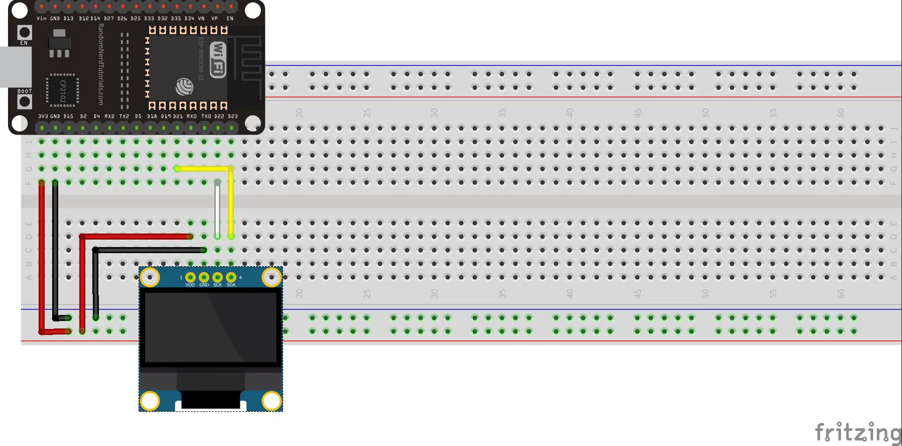

# Sh1106 driver for Toit

Image source: [botland.de](https://botland.de/blog/esp32-anschluss-eines-oled-displays/)

Tiny OLED Displays usually come with two kinds of drivers. The Ssd1306 or the Sh1106 driver. This is a driver for the Sh1106 chipset based on the [Ssd1306](https://github.com/toitware/toit-ssd1306) package created by [@floitsch](https://github.com/floitsch).

This package also contains an experimental driver for SPI mode. **This is currently untested since I don't have one at hand.**

